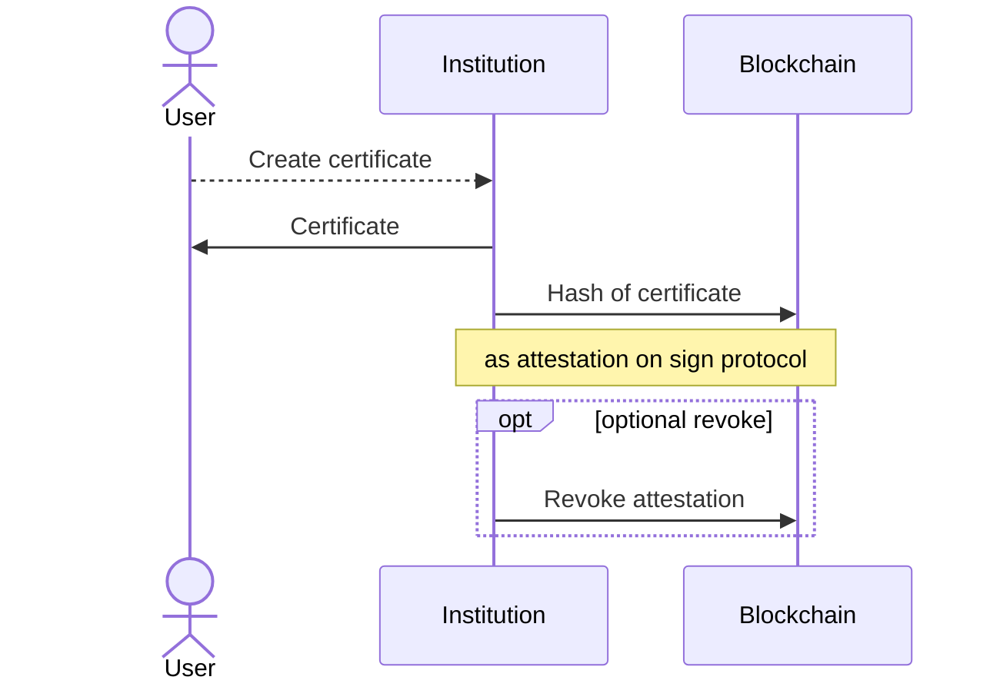
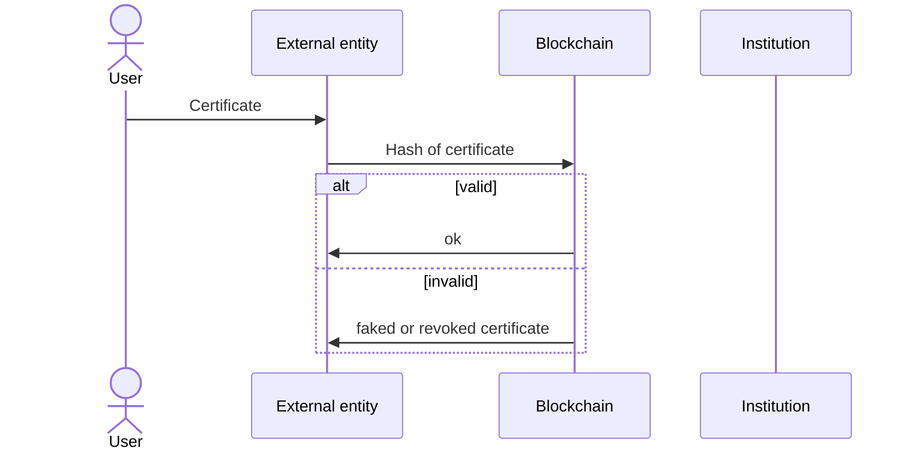
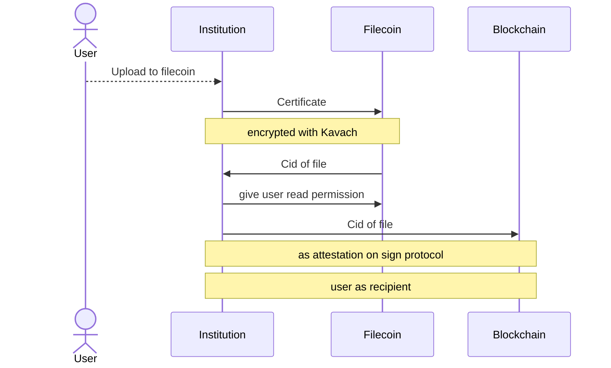
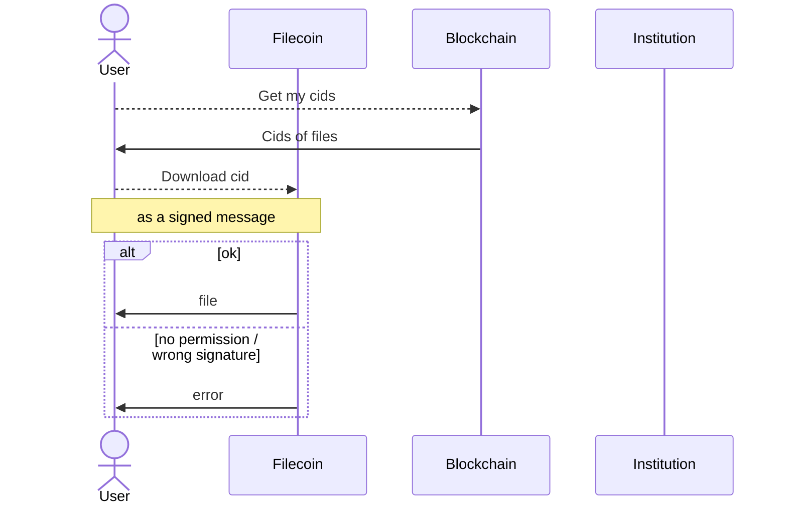

# onchain-certificates

**The aim of this project is to offer a framework that any institution can quickly fork and set up. Central authorities can issue certificates, granting users the ability to easily verify their legitimacy, leveraging blockchain advantages while completely abstracting its complexity for a seamless user experience.** 

### description

This project enables central authorities to easily attest, and if necessary revoke, the hash of their certificates on-chain, giving anyone the ability to effortlessly verify the legitimacy of these certificates.
The blockchain is seamlessly abstracted away, providing a user-friendly experience for the central authority issuing certificates, the users downloading the certificates and the entities validating them.
Moreover, it empowers users with a wallet to securely store these certificates permanently and encrypted on Filecoin. No funds are required; all that's needed is a wallet.
The project is designed to facilitate self-issuance of certificates with minimal adjustments. It is currently fully operational for our coding school, 42Heilbronn and can be reached under the following url:

## overview 

The project consists of 5 parts:
- [example_scripts](example_scripts) This folder contains scripts for easily testing individual parts of the project.
- [overview](overview) the landing page with links to the following services
- [attester](attester) the service to create and download the certificates
- [validator](validator) the frontend to validate the certificates
- [filecoin_viewer](filecoin_viewer) the frontend to download their certificates from filecoin

## Process Workflow

### Certificate creation

### Certificate validation
The diagram illustrates that the Institution's role in the process has become obsolete; even after its shutdown, the process continues to function seamlessly.

## Optional decentalised storage of certificates

### Certificate upload

### Certificate download from filecoin
The diagram illustrates that the Institution's role in the process has become obsolete; even after its shutdown, the user retains the ability to access its certificates.

### technical

This project consists of a backend automatically creating certificates as pdf files.
These SHA256 hash of these certificates are attested onchain.
Users are able to download the certificates on a frontend, while admins have a dashboard to revoke any of these attestations invalidating the certificate.

A separate frontend has the ability to drag&drop a file, hashing it on the frontend without uploading the file and making a request to the sign protocol api to get the eid of the attestation. 
That eid is used to get the exact attestation from an RPC, adding an additional layer of security, since its not required to trust the sign protocol api.
It is checked whether the attestation hasn’t been revoked, the hash matches and that it has been attested by the correct entity.
If all of these checks pass the uploaded file is shown as valid, otherwise it will be marked as invalid.
Since this does not depend on our backend a fork of the frontend can still be used, even after the institution origianlly giving out the certificates has shut down. 

If the user decides to connect with a wallet using wallet connect, he gets the ability to upload any certificate to filecoin / lighthouse. Lighthouse ensures a permanent encrypted storage. The users address is added to the allowed list of recipients. An attestation is then made from the user himself with the cid of the file and a name chosen by the user. This ensures that the user will never lose his cid. The attestation is on-chain but utilising delegate calls ensuring that the user does not need funds.
On a different frontend, which doesn’t need a connection to our backend the user can connect with his wallet. A request to the sign protocol is made to get all the eids that have been liked to this users wallet utilising the previously made attestations. The user gets the ability to download any of these files from the filecoin network. Since this service does not depend on any backend the user should be able to always keep access to the certificates, even after the institution originally giving out the certificates has shut down.

