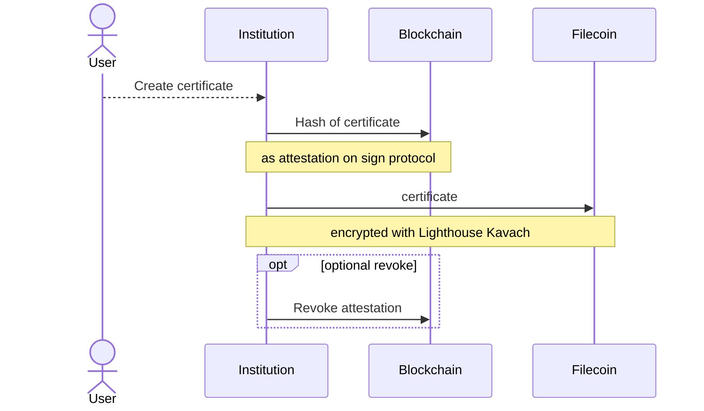
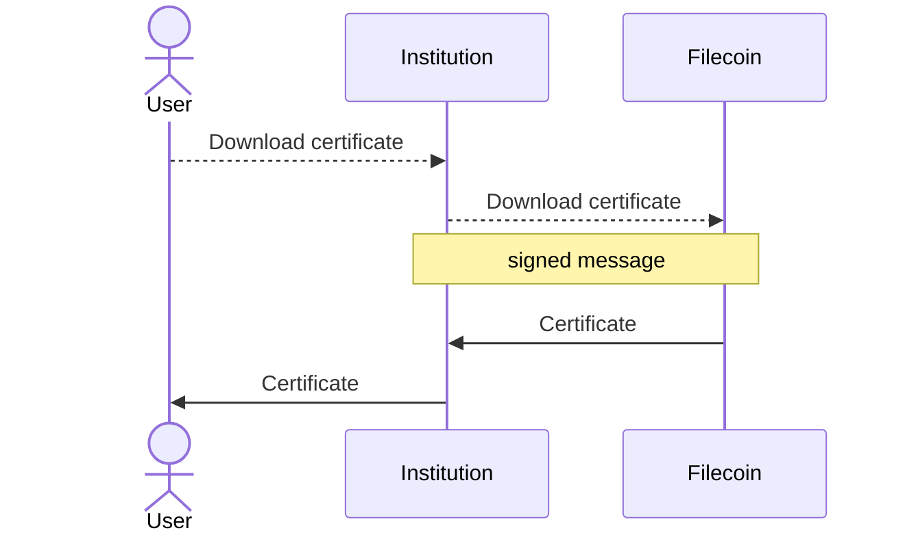
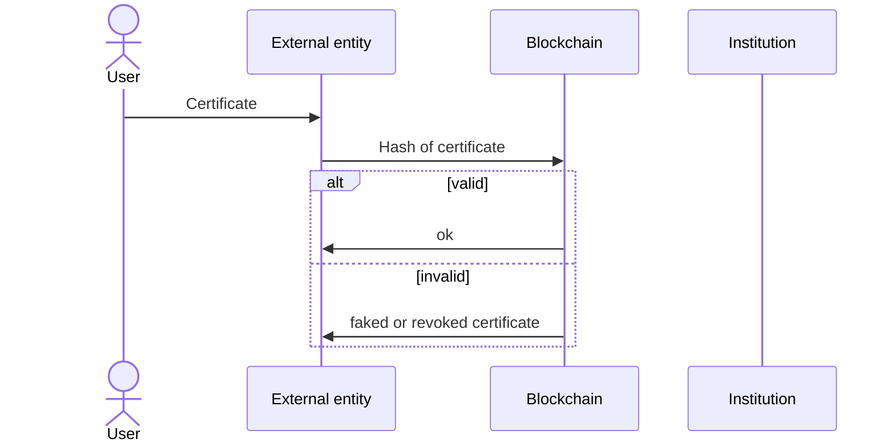
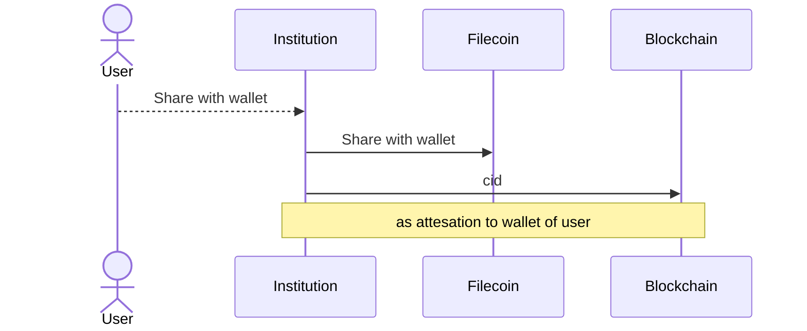
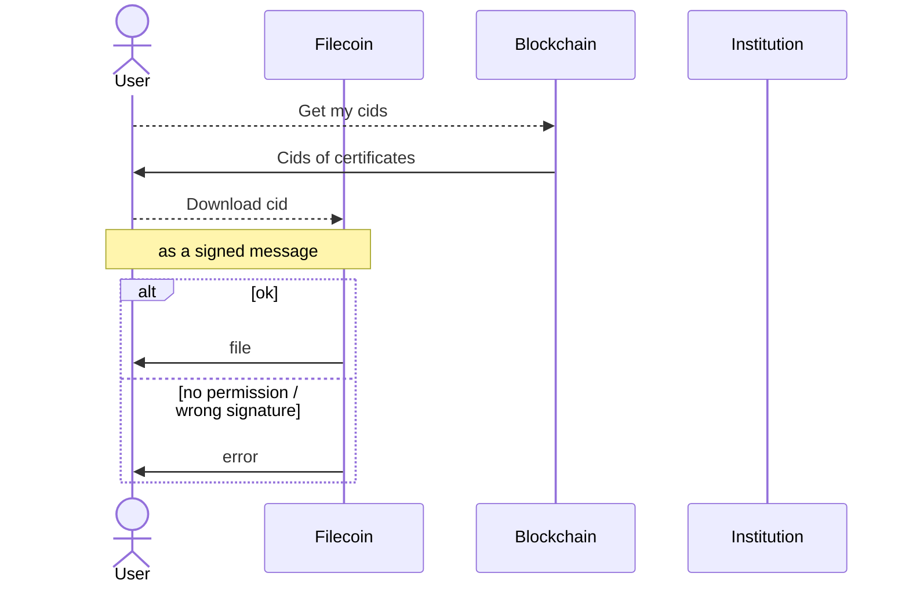

# onchain-certificates

## LIVE VERSION:
### https://www.cert-attest.lol/

**The aim of this project is to offer a framework that anyone can fork and set up themselves. Central authorities can issue and revoke certificates, granting anyone the ability to easily verify their legitimacy, leveraging blockchain advantages while abstracting its complexity for a seamless user experience.** 

### description

The project offers a straightforward framework for central authorities looking to harness the benefits of blockchain when issuing certificates, without requiring users to have a wallet. It is designed to support the self-issuance of certificates with minimal modifications needed.

It comprises three main components: creation, downloading, and verification.

After users log in through the frontend, they can initiate the certificate creation process. The backend will store the certificate's hash on the blockchain as an attestation and upload the encrypted certificate to Lighthouse. 
Users can download their certificate at any time directly from the backend, which retrieves it from Lighthouse.
A separate frontend allows anyone to upload a certificate file to verify its authenticity. This system ensures that certificates can still be validated, even if the original issuing institution no longer exists.

The creation, downloading, and verification of the certificates fully abstract the blockchain from the users, providing a user-friendly experience without the need to create a wallet.

However, if a user wishes to directly download certificates from Lighthouse, they will need a wallet to sign messages. Through the frontend, users can link their certificates to their wallet address. A separate frontend allows them to view a list of their certificates and download any of them. As this system is fully decentralized, users can continue to access their certificates even if the original issuing institution ceases to exist.

## overview 

The project consists of 5 parts:
- [example_scripts](example_scripts) This folder contains scripts for easily testing individual parts of the project.
- [overview](docs) the landing page with links to the following services
- [attester](attester) the service to create and download the certificates
- [validator](validator) the frontend to validate the certificates
- [filecoin_viewer](filecoin_viewer) the frontend to view and download own files from lighthouse / filecoin

## Process Workflow

### Certificate creation

### Certificate download

### Certificate validation
The diagram illustrates that the Institution's role in the process has become obsolete; even after its shutdown, the process continues to function seamlessly.

## Optional decentalised access of certificates

### Certificate upload

### Certificate download from filecoin
The diagram illustrates that the Institution's role in the process has become obsolete; even after its shutdown, the user retains the ability to access its certificates.

### technical

This project involves three components: a frontend + backend for managing certificate creation and download (called attestor), a frontend for certificate validation (called validator) and another frontend to view and download certificates directly from lighthouse (called filecoin_viewer)

On the attestor, logged-in users can access a page displaying available certificates and their creation status. They can initiate the creation process for certificates that haven't been generated yet. The system generates a PDF certificate, hashes it with SHA256, and stores it encrypted on Lighthouse. The hash is then attested on-chain using the ethsign SDK, the attestation emits the hash as an event, making it easily queryable for validation purposes.
The file's content identifier (CID) is stored in a local database, together with the user who created it.
For already created certificates, users can download them. The backend retrieves the certificate from Lighthouse using the previously stored cid and provides it to the user.
The user has also the ability to give any wallet the permission to download the certificate directly from lighthouse. The users address is added to the allowed list of recipients on lighthouse and an attestation is then made with the cid of the file and a name chosen by the user. This ensures that the user will never lose his cid.

The validator has the ability to drag&drop a file, hashing it on the frontend without uploading the file and making a request to the sign protocol api to get the eid of the attestation. 
That eid is used to get the exact attestation from an RPC, adding an additional layer of security, since its not required to trust the sign protocol api.
It is checked whether the attestation hasn’t been revoked, the hash matches and that it has been attested by the correct entity.
If all of these checks pass the uploaded file is shown as valid, otherwise it will be marked as invalid.
Since this does not depend on our backend a fork of the frontend can still be used, even after the institution origianlly giving out the certificates ceases to exist.

On the filecoin_viewer, which also doesn’t need a connection to our backend the user can connect with his wallet. A request to the sign protocol is made to get all the eids that have been liked to this users wallet utilising the previously made attestations. The user gets the ability to download any of these files from the filecoin network. Since this service does not depend on any backend the user should be able to always keep access to the certificates, even after the institution originally giving out the certificates ceases to exist.
